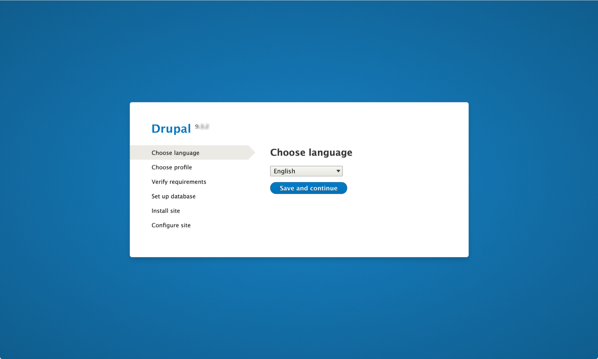

Migrating a PHP project from environment A to environment B is a task we
will have to do during our career as PHP developers.
[[Drupal]](https://www.drupal.org/) is a free and open-source
content management system published under the GNU General Public License
and written in [[PHP]](https://www.php.net/). This article will
describe a method to migrate a Drupal application from Pantheon to
Amezmo.

## **Before we start, let's review what you will need:**

-   Access to the Pantheon account on which the site you want to migrate
-   An active account on [[GitHub]](https://github.com/),[[GitLab]](https://about.gitlab.com/fr-fr/), or
[[Bitbucket]](https://bitbucket.org/)

-   An active account on the [[Amezmo]](https://www.amezmo.com/) platform

-   A working [[Git]](https://git-scm.com/) installation on your computer

## **Now we are ready to start**

1.  Log in to Pantheon and navigate to your user dashboard, then select the website you want to migrate from.

2.  Go to the **Live** branch and select the **Backups** item in the right side menu.

3.  Create a new backup of a month by clicking on the button \'\'**Create New Backup**\'\', and you will have: a **Database**,
 a **Code** that corresponds to the structure of the Drupal project except for some files in the directory files, and finally the
 directory **Files** which contains the remaining files of your project.

4.  Use the various download buttons to download the database, code, and  files to your local operating system.

5.  Once all the downloads are done, you have to reorganize your project
folder by placing all the content of the files folder at the following address: 
`[drupal_root\]/web/sites/default/files` where `[drupal_root]` is the **root** of the code directory previously downloaded.

It is time to think about importing the project from our local machine
to Amezmo.

## **Import Drupal project into Amezmo platform**

#### **Import Your Code**

In our scenario, we will use **Git** (remember that we want to preserve the
Git commit history). Therefore, we will have to take care of several
things to keep our commit history already available after exporting the
project from **Pantheon**. To do this we will follow the steps below to get
our project working on **Amezmo**.

#### **Steps** 

-   Create a new repository on GitHub, GitLab or Bitbucket.

-   Initial Commit and git push

-   Create an Amezmo Application and first Deployment

-   Restore Database

-   Enjoy your Drupal project in a new environment

### **Create a new repository on GitHub, GitLab, or Bitbucket.**

It is for us here, to create a remote repository to send our project
previously reorganized on our local machine, for this you can use
Github, GitLab, or Bitbucket for the remote repository. In this article,
we use GitHub, create a new GitHub account, and log in to your existing
account. Create the repository by going to the top right corner of the
GitHub application, and clicking on New Repository.

Fill in the form with the following values. Everything else, except the
Repository name field, can be left at the default value. Use the name of
your project in this case we will use the name `[my-drupal-site]`
for the repository name. Click the green **Create Repository** button
after filling in the form.

### **Initial Commit and git push**

After the previous step, it\'s time for us to push our local drupal
project on GitHub and for that, we have to tell our local Git repository
that there is now a remote place (GitHub) where the code can be pushed.

This is easy and only requires a few more steps. Run the following set
of commands in the `[drupal_root]` directory which is the root of
our project locally. Make sure to replace `$USERNAME` with our own
GitHub username before running the commands.

>USERNAME=\<your GitHub username>
> 
>git remote add origin git\@github.com:\$USERNAME/my-drupal-site.git
>
>git branch -M main
>
>git push -u origin main

After running the commands above, we should see something similar to the
screenshot below.

### **Create an Amezmo Application and first Deployment**

Now that our code is on GitHub, we are ready to launch our Amezmo
application instance to deploy our Drupal project. This instance will be
where our Drupal project is both hosted and deployed. Log into your
Amezmo account and launch a new application by clicking the **\"Add
Application\"** button at the top of the page.

In the form for creating a new application, select PHP as the
application type, give your site a name, and optionally a domain name
(which can always be added later). Then choose PHP version 7.x and
Composer 2.x. From there, choose the type of instance you want and click
**\"Run\"**. Amezmo will run your application environment for you, which
usually takes a few minutes.

When this process is complete, choose a Git provider. Choose GitHub, or
your preferred provider and follow the authentication instructions.
Choose your repository, your branch, and your application type in the
form.

After clicking the "**Continue**" button, Amezmo asks you about
automatic deployments. Choose "**Yes**". By using automatic deployments,
a new deployment starts after commits are created in the main branch.
Typically, this is after running `git push`, but deployments are
also triggered by merging a pull request, for example.

After clicking "**Next**", Amezmo pulls your code from GitHub and runs
the initial deployment. View the Deployments tab to verify a successful
deployment. Click on the deployment to view real-time updates.

### **Restore Database** 

Restoring the database here is just importing the database file we
downloaded from the pantheon, and to do this we need to at our
deployment dashboard on Amezmo go to `Production > Database >
Backup/Restore` respectively where we would have two options Backup and
Restore. The one we are interested in is **Restore** then click on it
and import the database file given from your local machine

Once you click on it, the following dialog box appears and allows you to
go directly to the file system of the local machine to find the file.
Once it is found, select and click the restore database button to import
the file.

### **Enjoy your Drupal project in a new environment**

Now that we have completed the initial setup and deployment, we can move
forward. To do this, click on the automatically generated URL for your
application at the top of the page ending in **amezmo.co**. This should
bring up the Drupal installation screen.

From here, you will need to select your language, choose the
\"**Standard**\" installation profile, and then click \"**Save and
Continue**\". Drupal will automatically detect your database credentials
using the environment variables provided, and begin the installation
process. It will then redirect you to a window like the one below.

It tells you that Drupal is already installed and offers you to **update
the installation script** or to click on the link to the **existing
site**.

Click on the existing site or update the script to allow you to enjoy
your drupal project on Amezmo.
